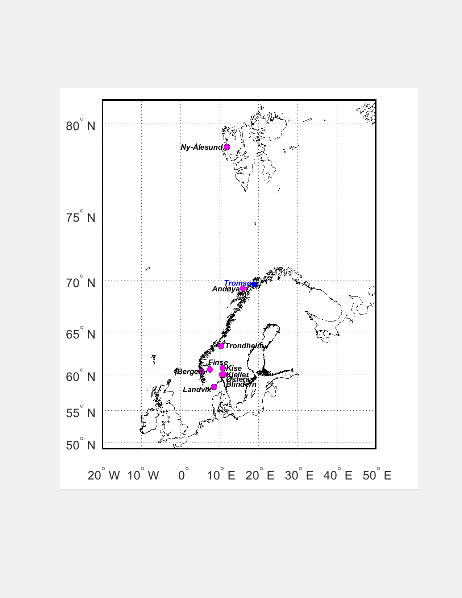

# About the Norwegian UV-network
The Norwegian UV-network consists of 9 stations with GUV multiband filter radiometers (Biospherical Instruments inc.). The stations are strategically placed in different locations to provide the best latitude and topographical coverage. The southernmost station is placed nearby Grimstad (Landvik), and the northernmost in Ny-Ålesund in Svalbard, as shown on the map below

## Overview
The repositories contain 11 quality controlled dose products for 9 UV monitoring stations in Norway for the period 1995/96 - 2017. The data are presented as hourly mean irradiances, daily-, monthly- and yearly integrated doses for real sky conditions, as well as cloudfree conditions. In addition, there is a repository with minute values of UV-indices. Gaps in measurements have been complemented with modelled values, based on cloud modification factors derived from synoptic cloud observations and pyranometer data, as well as derived from the [STRÅNG model](http://strang.smhi.se/). 

## Online UV-Index
Online and forecasted UVI, with a graphical presentation, are found on  
*  NRPA [Online UV measurements](https://www.nrpa.no/uvnett/default_en.aspx)
*  NILU [Near real-time and forcasted UV](http://uv.nilu.no/)

## Cooperating partners
The UV monitoring network is a cooperation between the [Norwegian Radiation Protection Authority](https://www.nrpa.no/) (NRPA), [NILU - Norwegian Institute for Air Research](http://www.nilu.no/), and the [University of Oslo](http://www.mn.uio.no/fysikk/english/). NRPA is responsible for the six instruments located in Landvik, Østerås, Bergen, Finse, Kise, and Trondheim, and the calibration of the network instruments, whereas NILU is responsible for running the three instruments in Oslo (Blindern), Andøya/Tromsø and in Ny-Ålesund. The Blindern instrument is operated by the Department of physics, University of Oslo. Data from the instruments at Blindern and in Ny-Ålesund are extensively used in the national monitoring programme on the atmospheric ozone layer and natural ultraviolet radiation, financed by the Norwegian Environment Agency.

