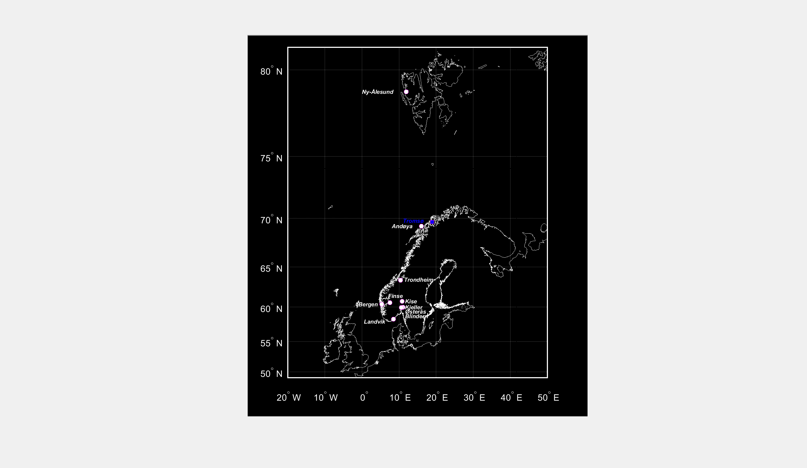

# About the Norwegian UV-network, partners and data available.

The UV-network consists of 9 stations with GUV multiband filter radiometers (Biospherical Instruments inc.), locations shown below 

## Overview
The repositories contain 11 quality controlled doseproducts for 10 UV monitoring stations in Norway, for the period 1995/96 - 2017. The data are presented as hourly mean irradiances, daily-, monthly- and yearly integrated doses for real sky conditions, as well as cloudfree conditions. Gaps in measurements have been complemented with modelled values, based on cloud modification factors derived from synoptic cloud observations and pyranometer data, as well as derived from the [STRÅNG model](http://strang.smhi.se/). Ozone values are based on Each file contains a column flagging the fraction of the time interval that are based on real sky measurements (0.00 indicating no measurements).

## Online UV-Index
Graphic presentation of [Online UV measurements](https://www.nrpa.no/uvnett/default_en.aspx)

## Cooperating partners

